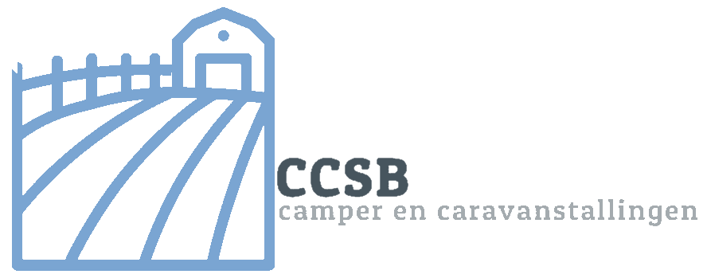

  

  <h3 align="center">Project CCSB - Camper & Caravan Stalling Bentelo</h3>

  

    <strong>Menu</strong>
	 
	<a href="https://github.com/LucasHuls/Project-CCSB/wiki"><strong>Wiki »</strong></a>
	 
    <a href="https://dev.azure.com/Project-CCSB/"><strong>Scrum-Bord »</strong></a>
	 
    <a href="https://github.com/LucasHuls/Project-CCSB/issues"><strong>Meld een bug »</strong></a>
	 
    <a href="ttps://github.com/LucasHuls/Project-CCSB"><strong>Explore the docs »</strong></a>
	 
	<a href="https://github.com/LucasHuls/Calc4You-Project-Groep-5/tree/master/readme-bestanden"><strong>GIT Commands & Uitleg »</a>
  

De heer van der Stal is eigenaar van camper- en caravanstalling Bentelo. In het verleden had hij een
pluimveebedrijf, maar door de steeds strengere milieueisen die door de overheid zijn opgelegd was
voortzetting daarvan een te kostbare zaak. Carlo, de zoon van de heer van der Stal, heeft de zaak
inmiddels van zijn vader overgenomen en gebruikt de voormalige stallen nu voor het stallen van
campers en caravans. Inmiddels is er, verdeeld over 3 hallen, een capaciteit van 60 plekken waar of
een camper of een caravan gestald kan worden. Niet alle plekken zijn geschikt voor campers, omdat
het in- en uitrijden van een camper lastiger is dan van een caravan.

## Built With

- .NET CORE 5.0
- Visual Studio 2019

## Authors

👤 **Sam Elfring**

- GitHub: [@SamElfring](https://github.com/SamElfring)
- LinkedIn: [LinkedIn](https://www.linkedin.com/in/sam-elfring-061822194)

👤 **Lucas Huls**

- GitHub: [@LucasHuls](https://github.com/LucasHuls)
- LinkedIn: [LinkedIn](https://www.linkedin.com/in/lucas-huls-261821194)

👤 **Bram van Nek**

- GitHub: [@BramvanNek](https://github.com/BramvanNek)

👤 **Guus Hinrichs**

- GitHub: [@Babbeleguuskes](https://github.com/Babbeleguuskes)

## 📝 License

This project is [MIT](./MIT.md) licensed.